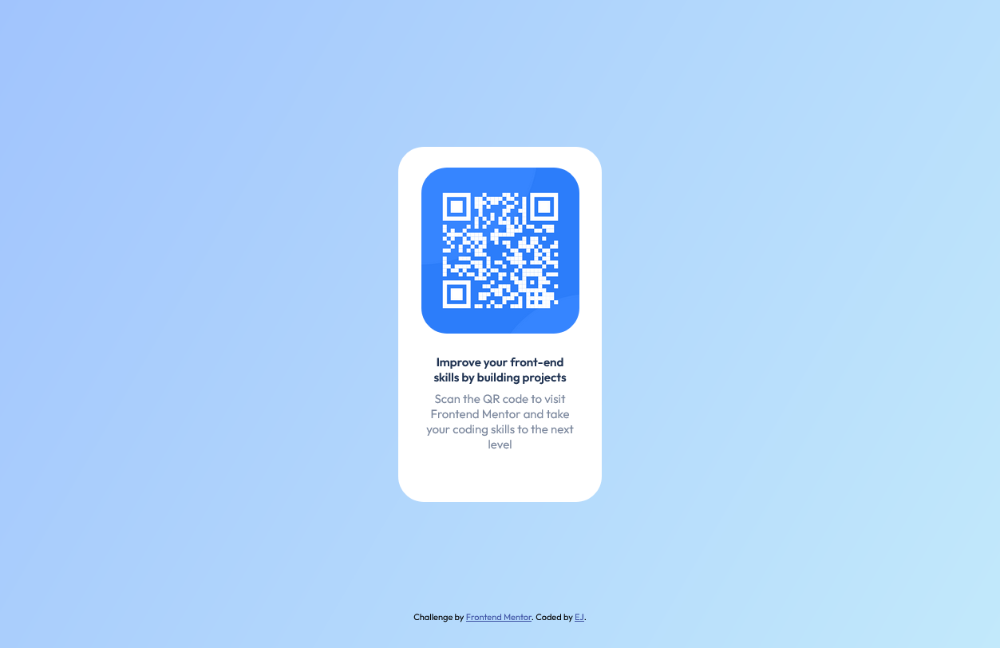

# Frontend Mentor - QR code component solution

This is a solution to the [QR code component challenge on Frontend Mentor](https://www.frontendmentor.io/challenges/qr-code-component-iux_sIO_H). Frontend Mentor challenges help you improve your coding skills by building realistic projects.

## Table of contents

- [Overview](#overview)
  - [Screenshot](#screenshot)
  - [Links](#links)
- [My process](#my-process)
  - [Built with](#built-with)
  - [What I learned](#what-i-learned)
  - [Continued development](#continued-development)
  - [Useful resources](#useful-resources)

## Overview

### Screenshot



### Links

- Solution URL: [Solution URL](https://github.com/ieunjung/vanillawebprojects/tree/main/QR-CODE-COMPONENT)
- Live Site URL: [Live site URL](https://ieunjung.github.io/vanillawebprojects/QR-CODE-COMPONENT/)

## My process

### Built with

- Semantic HTML5 markup
- CSS custom properties
- Mobile-first workflow

### What I learned

I can trim or shape the edges as I like using this property. Find a useful resource below.

```css
.box_img {
  clip-path: inset(10% 5% 10% 5% round 2rem 2rem 2rem 2rem);
}
```

Below code, the first one (`display: flex;`) sets the children elements to flex and itself to block, while the second one (`display: inline-flex;`) makes itself inline and the children flex.

```css
.wrap {
  display: flex;
}

.wrap {
  display: inline-flex;
}
```

### Continued development

- CSS Grid
- Responsive media queries

### Useful resources

- [Codecademy - Learn Intermediate CSS](https://www.codecademy.com/enrolled/courses/learn-intermediate-css) - This helped me for learning Flexbox.
- [CSS clip-path maker](https://bennettfeely.com/clippy/) - This is useful for easily getting figures for the `clip-path` property without calculating complex numbers.
- [WebGradients](https://webgradients.com/) - This helped me select an attractive gradient color from a variety of options.